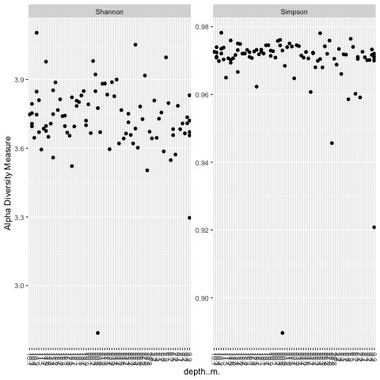

title: "Final project"
author: "Reagan Dodge and Alyssa Tidwell"
date: "12/7/2019"
output: html_document
---

**This document is designed to explain the process needed to take genenetic sequences and turn them into workable data that is ready for analysis.**   
  
**This process has 5 steps:**  

* **DADA2 (not the disease)**
* **Assign taxonomy**
* **Phyloseq**   
* **Alpha diversity**  
* **Analysis**  

---------------------  

### **DADA 2**  
    
Our starting point is a set of Illumina-sequenced paired-end fastq files that have been split (or “demultiplexed”) by sample and from which the barcodes/adapters have already been removed. The DADA2 package denoises and removes sequencing errors from this sequence data. The resulting amplicon sequence variant (ASV) table records the number of times each sequence variant was observed in each sample. This provides a census of a community. We then assign taxonomy, and import the information into the phyloseq package for the analysis of microbiome data.  

**Create quality profile**  
First, prepared fastq files are checked for quality by visualizing the quality profiles of both the forward and reverse reads.  

```{r echo=FALSE, out.width = '100%'}
knitr::include_graphics("quality_profile_fnFs.png")
knitr::include_graphics("quality_profile_fnRs.png")
```

The forward read quality (top) is not great, and the reverse read quality (below) is even worse.   

**Filtering**  
Luckily for us, the next step is to filter by the maximum number of “expected errors” allowed in a read with the maxEE parameter. The following code is truncating the forward reads at 250 base pairs, and the reverse reads at 160 base pairs:

```{r, echo=TRUE, eval=FALSE}
out <- filterAndTrim(fnFs, filtFs, fnRs, filtRs, truncLen=c(250,160),
                     maxN=0, maxEE=c(2,2), truncQ=2, rm.phix=TRUE,
                     compress=TRUE, multithread=TRUE) 
```
The output looks something like this:
```{r, echo=TRUE, eval=FALSE}
                              Reads.in    reads.out
Pooled_library_1_1.fastq.gz      73197     33343
Pooled_library_10_1.fastq.gz     79906     40434
Pooled_library_100_1.fastq.gz   148124     72661
Pooled_library_101_1.fastq.gz   126504     58011
Pooled_library_102_1.fastq.gz   123834     59020
Pooled_library_103_1.fastq.gz   134525     60417
```   
This is showing us that out of the 73,197 total reads contained in the first file, only 33,343 were retained. 


**Error Rates**  
The error rate of the filtered data is then measured. The learnErrors method learns this error model from the data, by alternating estimation of the error rates and inference of sample composition until they converge on a jointly consistent solution. 
**Let's start with the error rates of the forward reads:**
```{r echo=FALSE, out.width = '100%'}
knitr::include_graphics("error_plot_F.png")

```


```{r, echo=TRUE, eval=FALSE}
> # Learn error rates ####
> errF <- learnErrors(filtFs, multithread=TRUE)
105096000 total bases in 420384 reads from 8 samples will be used for learning the error rates.
```
The error rates for each possible transition (A→C, A→G, …) are shown. Points are the observed error rates for each consensus quality score. The black line shows the estimated error rates after convergence of the machine-learning algorithm. The red line shows the error rates expected under the nominal definition of the Q-score. Here the estimated error rates (black line) are a good fit to the observed rates (points), and the error rates drop with increased quality as expected.

**And now the error rates of the reverse reads:**
```{r echo=FALSE, out.width = '100%'}

```

```{r, echo=TRUE, eval=FALSE}
> errR <- learnErrors(filtRs, multithread=TRUE)
101655520 total bases in 635347 reads from 12 samples will be used for learning the error rates.
```
We do expect to see a higher error rate weith reverse reads, so these results do fall in line with expected values.  

**Dereplication**  
Dereplication combines all identical sequencing reads into “unique sequences” with a corresponding “abundance” equal to the number of reads with that unique sequence. Dereplication substantially reduces computation time by eliminating redundant comparisons with the following code:
```{r echo=TRUE, eval=FALSE}
derepFs <- derepFastq(filtFs, verbose=TRUE)
derepRs <- derepFastq(filtRs, verbose=TRUE)
```


DADA2 retains a summary of the quality information associated with each unique sequence. The consensus quality profile of a unique sequence is the average of the positional qualities from the dereplicated reads. These quality profiles inform the error model of the subsequent sample inference step, significantly increasing DADA2’s accuracy. Results for each are listed as such:

```{r echo=TRUE, eval=FALSE}
Dereplicating sequence entries in Fastq file: ../Chagos_Data/raw_data/filtered/99_F_filt.fastq.gz
Encountered 30839 unique sequences from 77069 total sequences read.
```

***Sample Inference***  
The sample core inference algorithm return an object describing DADA2 denoising results, for instance "128 sequence variants were inferred from 1979 input unique sequences."


```{r echo=TRUE, eval=FALSE}
Forward reads:
dadaFs <- dada(derepFs, err=errF, multithread=TRUE)
Sample 1 - 33343 reads in 14232 unique sequences.
Sample 2 - 40434 reads in 17298 unique sequences.
Sample 3 - 72661 reads in 29171 unique sequences.
Sample 4 - 58011 reads in 25098 unique sequences.
Sample 5 - 59020 reads in 24798 unique sequences.
Sample 6 - 60417 reads in 25862 unique sequences.
Sample 7 - 51443 reads in 22681 unique sequences.
Sample 8 - 45055 reads in 19498 unique sequences.
Sample 9 - 56475 reads in 21577 unique sequences.
Sample 10 - 57620 reads in 25001 unique sequences.
...
Reverse reads:
> dadaRs <- dada(derepRs, err=errR, multithread=TRUE)
Sample 1 - 33343 reads in 7272 unique sequences.
Sample 2 - 40434 reads in 9051 unique sequences.
Sample 3 - 72661 reads in 16293 unique sequences.
Sample 4 - 58011 reads in 12317 unique sequences.
Sample 5 - 59020 reads in 11806 unique sequences.
Sample 6 - 60417 reads in 13353 unique sequences.
Sample 7 - 51443 reads in 10652 unique sequences.
Sample 8 - 45055 reads in 10028 unique sequences.
Sample 9 - 56475 reads in 13553 unique sequences.
Sample 10 - 57620 reads in 11760 unique sequences.
...
```

**Merging reads**  
We then merge the forward and reverse reads together to obtain the full denoised sequences. Merging is performed by aligning the denoised forward reads with the reverse-complement of the corresponding denoised reverse reads, and then constructing the merged “contig” sequences. By default, merged sequences are only output if the forward and reverse reads overlap by at least 12 bases, and are identical to each other in the overlap region.  
We use the following code:
```{r echo=TRUE, eval=FALSE}
> mergers <- mergePairs(dadaFs, derepFs, dadaRs, derepRs, verbose=TRUE)
```

And get an overview of the results:

```{r echo=TRUE, eval=FALSE}
  abundance forward reverse nmatch nmismatch nindel prefer accept
1      3531       1       2    156         0      0      1   TRUE
2      2268       3       1    160         0      0      2   TRUE
3      1936       4       1    160         0      0      2   TRUE
4      1852       6       1    160         0      0      2   TRUE
5      1809       5       1    160         0      0      2   TRUE
6      1799       8       1    160         0      0      2   TRUE
```
**Build a table**  
We can now construct an amplicon sequence variant table (ASV) table, a higher-resolution version of the OTU table produced by traditional methods. The code to do that is:  

```{r eval=FALSE, echo=TRUE}
> seqtab <- makeSequenceTable(mergers)
```
We can ensure that it was built properly by checking the dimentions of that table:
```{r eval=FALSE, echo=TRUE}
> dim(seqtab)
[1]  163 6821
```
**Remove chimeras**  
The core dada method corrects substitution and indel errors, but chimeras remain. Fortunately, the accuracy of the sequence variants after denoising makes identifying chimeras simpler than it is when dealing with fuzzy OTUs. Chimeric sequences are identified if they can be exactly reconstructed by combining a left-segment and a right-segment from two more abundant “parent” sequences.
```{r echo=FALSE, out.width = '100%'}

```

```{r eval=FALSE, echo=TRUE}
> seqtab.nochim <- removeBimeraDenovo(seqtab, method="consensus", multithread=TRUE, verbose=TRUE)
Identified 146 bimeras out of 6821 input sequences.
```

When we account for the abundances of those variants we see they account for only about 1% of the merged sequence reads.
```{r eval=FALSE, echo=TRUE}
> sum(seqtab.nochim)/sum(seqtab)
[1] 0.9890885
```
**Tracking reads through the pipeline**  
Finding the number of reads that made it through each step in the pipeline can be done using the following code:
```{r eval=FALSE, echo=TRUE}
> getN <- function(x) sum(getUniques(x))
> track <- cbind(out, sapply(dadaFs, getN), sapply(dadaRs, getN), sapply(mergers, getN), rowSums(seqtab.nochim))
> colnames(track) <- c("input", "filtered", "denoisedF", "denoisedR", "merged", "nonchim")
> rownames(track) <- sample.names
```
This results in a table:
```{r eval=FALSE, echo=TRUE}
> head(track)
     input filtered denoisedF denoisedR merged nonchim
1    73197    33343     33273     33214  32424   32405
10   79906    40434     40327     40365  39414   39414
100 148124    72661     72400     72529  70807   66930
101 126504    58011     57855     57917  56434   55015
102 123834    59020     58859     58955  57513   57513
103 134525    60417     60331     60362  59042   58909
```

We lost about half of our raw reads, with the majority of the loss occuring during filtering.

-------

### **Assign taxonomy**   
The assignTaxonomy function takes as input a set of sequences to ba classified, and a training set of reference sequences with known taxonomy, and outputs taxonomic assignments with at least minBoot bootstrap confidence.
```{r eval=FALSE, echo=TRUE}
taxa <- assignTaxonomy(seqtab.nochim, "~/tax/silva_nr_v128_train_set.fa.gz", multithread=TRUE)
#and to add species (optional) use:
taxa <- addSpecies(taxa, "~/tax/silva_species_assignment_v128.fa.gz")
#then inspect:
taxa.print <- taxa # Removing sequence rownames for display only
rownames(taxa.print) <- NULL
head(taxa.print)
```
The result is this great looking table!
```{r eval=FALSE, echo=TRUE}
    Kingdom    Phylum           Class                 Order                   Family                  
[1,] "Bacteria" "Cyanobacteria"  "Oxyphotobacteria"    "Chloroplast"           NA                      
[2,] "Bacteria" "Cyanobacteria"  "Oxyphotobacteria"    "Chloroplast"           NA                      
[3,] "Bacteria" "Proteobacteria" "Alphaproteobacteria" "Sphingomonadales"      "Sphingomonadaceae"     
[4,] "Bacteria" "Proteobacteria" "Gammaproteobacteria" "Betaproteobacteriales" "Burkholderiaceae"      
[5,] "Bacteria" "Proteobacteria" "Gammaproteobacteria" "Alteromonadales"       "Pseudoalteromonadaceae"
[6,] "Bacteria" "Proteobacteria" "Gammaproteobacteria" "Oceanospirillales"     "Halomonadaceae"        
     Genus              
[1,] NA                 
[2,] NA                 
[3,] "Sphingomonas"     
[4,] "Pandoraea"        
[5,] "Pseudoalteromonas"
[6,] "Cobetia" 
```
We see only bacteria because we were specifically looking at the 16s gene. We make and export a Phyloseq object. 

**Is our information accurate?**  
In order to check the accuracy of our work so far, we'd need a mock community to compare it against. Since we don't have that yet, we'll skip this step for now.

---------------------

### **Phyloseq**  

Once we import abundance and related data from DADA2 (our Phyloseq object), we can use phyloseq's analysis wrappers for common analysis tasks.

Once Phyloseq is LOCKED AND LOADED with numbered sample names, we ensure that the rank names are all as we need them:
```{r eval=FALSE, echo=TRUE}
> rank_names(ps)
[1] "Kingdom" "Phylum"  "Class"   "Order"   "Family"  "Genus"   "Species"
```
The variables we'll be looking at are:

```{r eval=FALSE, echo=TRUE}
> sample_variables(ps)
 [1] "Pooled library ID (from GIS)"   "Barcode"                        "sample #"                      
 [4] "date"                           "Island"                         "site"                          
 [7] "Lat"                            "Long"                           "Reef Type"                     
[10] "Exposure"                       "Species tentative"              "RFLP ID Species ID - confirmed"
[13] "Colony Colour"                  "avg. site temp"                 "Temp Range (oC)"               
[16] "salinity"                       "Salinity Range (ppt)"           "depth (m)"                     
[19] "Depth Range (m)"                "Negatives"    
>ps 
```


```{r eval=FALSE, echo=TRUE}
phyloseq-class experiment-level object
otu_table()   OTU Table:         [ 2128 taxa and 93 samples ]
sample_data() Sample Data:       [ 93 samples by 20 sample variables ]
tax_table()   Taxonomy Table:    [ 2128 taxa by 7 taxonomic ranks ]
```

----------

Now that we've got our phyloseq objects we can starting looking into the analysis of variables. This stuff is hard to understand and we are aware the analysis may not be the most logical. 

### **Analysis** 
``` {r eval= FALSE, echo= TRUE}
> vegan::adonis(otu_table(ps_ra) ~ ps_ra@sam_data$`Colony Colour`)
```

```{r eval = FALSE, echo = TRUE}
Call:
vegan::adonis(formula = otu_table(ps_ra) ~ ps_ra@sam_data$`Colony Colour`) 

Permutation: free
Number of permutations: 999

Terms added sequentially (first to last)

                               Df SumsOfSqs  MeanSqs F.Model      R2 Pr(>F)
ps_ra@sam_data$`Colony Colour`  3   0.06071 0.020238 0.60114 0.01986  0.852
Residuals                      89   2.99627 0.033666         0.98014       
Total                          92   3.05699                  1.00000       

```

The functions in the vegan package contain tools for ordination methods and tools for the analysis of dissimilarities and community diversity. 

-------
We can also take a look at shannon diversity. Adding new columns to our data based off of this. 

```{r eval = FALSE, echo = TRUE}

shannon = vegan::diversity(otu_table(ps_ra),index = "shannon")
sample_data(ps_ra)$Shannon = shannon
```
And now richness with shannon
```{r eval = FALSE, echo = TRUE}

rich = specnumber(otu_table(ps_ra))
sample_data(ps_ra)$Richness = rich


meta = as.data.frame(sample_data(ps_ra))


meta$salinity = as.numeric(meta$salinity)


shannonmod = glm(Shannon ~ salinity,data=meta)
summary(shannonmod)

```

Now the outcomes of this model 

```{r eval = FALSE, echo = TRUE}
glm(formula = Shannon ~ salinity, data = meta)

Deviance Residuals: 
     Min        1Q    Median        3Q       Max  
-0.93293  -0.06287  -0.01167   0.08650   0.37743  

Coefficients:
            Estimate Std. Error t value Pr(>|t|)    
(Intercept)  3.33905    0.52554   6.354 1.25e-08
salinity     0.01131    0.01551   0.729    0.468    

(Dispersion parameter for gaussian family taken to be 0.02769579)

    Null deviance: 2.2027  on 80  degrees of freedom
Residual deviance: 2.1880  on 79  degrees of freedom
  (12 observations deleted due to missingness)
AIC: -56.662
```

------

Lets start taking a look at things 
``` {r eval = FALSE, echo = TRUE}
plot_bar(ps, fill = "Phylum") + facet_wrap(~Island) + theme(legend.position="bottom")
```

```{r echo=FALSE, out.width = '100%'}

```

This is hideous. We know.

The following code will give us a 3-dimensional representation of the first three axes of a Principal Coordinates Analysis (PCoA[2]) performed on the unweighted-UniFrac distance using all of the available sequences including both 5’ and 3’ sequences. 
```{r, eval=FALSE, echo=TRUE}
ps.ord    <- ordinate(ps)
plot_ordination(ps, ps.ord, color="Island")
psUF <- UniFrac(ps)

ps.pcoa <- pcoa(psUF)
```
We can view this graphically with a “scree plot”, an ordered barplot of the
relative fraction of the total eigenvalues associated with each axis.

```{r echo=FALSE, out.width = '100%'}

```


Now lets try different variables and have a look at those using shannon and simpson diversity. 

### **Richness and Alpha Diversity**

By site
```{r echo=FALSE, out.width = '100%'}

```

By island 
```{r echo=FALSE, out.width = '100%'}

```

By depth 
```{r echo=FALSE, out.width = '100%'}

```

By TempRange
```{r echo=FALSE, out.width = '100%'}

```


------

We wanted to move towards making a phylogenetic tree. As the code is long and tedious it won't be included. 
Below is the image. 
```{r echo=FALSE, out.width = '100%'}

```

This is also gross. So we are going to look into different variables by abundance and phylum groups.

By Bacteroidetes
```{r echo=FALSE, out.width = '100%'}

```

By Proteobacteria
```{r echo=FALSE, out.width = '100%'}

```

By Cyanobacteria 
```{r echo=FALSE, out.width = '100%'}

```


By Firmicutes
```{r echo=FALSE, out.width = '100%'}

```


By Epsilonbacteraeota
```{r echo=FALSE, out.width = '100%'}

```

By Actinobacteria
```{r echo=FALSE, out.width = '100%'}

```

Both Peros and Salomon islands seems to contain the highest abundance of life among the community structures overall. 

**And now some bar plots **

```{r echo=FALSE, out.width = '100%'}

```


